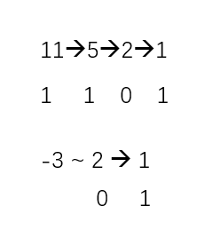

# Leetcode 初级算法 - 其他

二级标题格式：\[章节内题号\] \[题库内题号\] \[题目标题\]

## 1 191 位1的个数

我的思路：先想到的自然是直接用语言内置函数... 查了一下果然有... Integer.to各种string

```java
public int hammingWeight(int n) {
    char[] carr = Integer.toBinaryString(n).toCharArray();
    int cnt=0;
    for(char c:carr){
        if(c=='1') cnt++;
    }
    return cnt;
}
```

但是这样未免有点取巧了...有没有什么正常的做法呢？似乎可以从除2余2的思路上下手...

对于正数 以11为例 可以观察到11->5->2->1 其中11%2 5%2都等于1 最后到了1之后cnt还需要加1

对于负数 利用补码的性质 先转换成正数-1 最后返回结果的时候用32减就好了...



```java
public int hammingWeight(int n) {

    boolean isneg = (n<0);
    if(isneg) n=(-n)-1;
    
    if(n==0){
        return isneg?32:0;
    }
    
    int cnt=0;
    while(n!=1){
        if(n%2!=0) cnt++;
        n=n/2;
    }
    cnt++;
    
    return isneg?(32-cnt):cnt;
}
```

其他思路：最直接的：可以直接用AND操作来检查每一位...(居然没想到...残念...) [来源](https://leetcode.com/problems/number-of-1-bits/solution/)

```
public int hammingWeight(int n) {
    int bits = 0;
    int mask = 1;
    for (int i = 0; i < 32; i++) {
        if ((n & mask) != 0) {
            bits++;
        }
        mask <<= 1;
    }
    return bits;
}
```

更高级的技巧：利用n AND n-1的性质 每次翻转LSB到0 直到整个数字变成0 [来源](https://leetcode.com/problems/number-of-1-bits/solution/)


```java
public int hammingWeight(int n) {
    int sum = 0;
    while (n != 0) {
        sum++;
        n &= (n - 1);
    }
    return sum;
}
```

补充：Java对这个有内置支持... Integer.bitCount

其他思路：不仅可以考虑左移mask 也可以考虑右移n

最高端做法：[SWAR算法](https://www.cnblogs.com/katsura/p/5686138.html) 位操作的魔法... [Wikipedia词条：汉明重量](https://zh.wikipedia.org/wiki/%E6%B1%89%E6%98%8E%E9%87%8D%E9%87%8F)

## 2 461 汉明距离

我的思路：有了上一问对位操作的铺垫 很快就能想到这个题目应该是基于XOR

可以先直接对x y分别操作 (**注意** 第5行是不等于0而不是等于1 因为这个不是单纯位运算 1在不同位置对应的int的值是不同的！)

```java
public int hammingDistance(int x, int y) {
    int cnt=0;
    int mask=1;
    for(int i=0;i<32;i++){
        if(((x & mask) ^ (y&mask))!=0){
            cnt++;
        }
        mask<<=1;
    }
    return cnt;
}
```

也可以先计算x XOR y 再用第一问做法...

```java
public int hammingDistance(int x, int y) {
    return hammingWeight(x^y);
}
```

其他思路：基本都差不多...

## 3 190 颠倒二进制位

我的思路：没想到什么好的位操作做法...似乎逃不过二进制转换十进制了...

```java
public int reverseBits(int n) {
    char[] carr = Integer.toBinaryString(n).toCharArray();
    char[] c = new char[32];
    Arrays.fill(c,'0');
    System.arraycopy(carr,0,c,32-carr.length,carr.length);
    for(int i=0;i<32/2;i++){
        swap(c,i,32-1-i);
    }
    int sum=0, mask=1;
    for(int i=31;i>=0;i--){
        if(c[i]=='1') sum+=mask;
        mask<<=1;
    }
    return sum;
}

public static void swap(char[] arr, int a, int b){
    char tmp = arr[a];
    arr[a] = arr[b];
    arr[b] = tmp;
}
```

其他思路：位操作还是可以实现的 直接把sum逐次左移 n逐次右移

```java
public int reverseBits(int n) {
    int sum=0;
    for(int i=0;i<32;i++){
        sum<<=1;
        sum+=n&1;
        n>>=1;
    }
    return sum;
}
```

其他思路：分治法 每次二分交换一组 复杂度(log2 sizeof(int)) [来源](https://blog.csdn.net/zhangzhetaojj/article/details/80772526)

**注意** C++中可以直接使用>> 但是Java中需要使用>>> 因为Java的默认右移是保留符号位的 但是C++是编译器决定的

```java
//source: https://blog.csdn.net/zhangzhetaojj/article/details/80772526

public int reverseBits(int n) {
    n = (n << 16) | (n >>> 16);
    n = ((n & 0x00ff00ff) << 8) | ((n & 0xff00ff00) >>> 8);
    n = ((n & 0x0f0f0f0f) << 4) | ((n & 0xf0f0f0f0) >>> 4);
    n = ((n & 0x33333333) << 2) | ((n & 0xcccccccc) >>> 2);
    n = ((n & 0x55555555) << 1) | ((n & 0xaaaaaaaa) >>> 1);
    return n;
}
```


## 4 118 帕斯卡三角形

我的思路：基本的二重循环 需要注意下循环条件...

```java
public List<List<Integer>> generate(int numRows) {
    List<List<Integer>> l = new ArrayList<>();
    for(int i=1;i<=numRows;i++){
        List<Integer> li = new ArrayList<>();
        if(i==1) li.add(1);
        else {
            li.add(1);
            for(int j=0;j<i-2;j++){
                li.add(l.get(i-2).get(j)+l.get(i-2).get(j+1));
            }
            li.add(1);
        }
        l.add(li);
    }
    return l;
}
```

其他思路：基本都差不多...


## 5 20 有效的括号

我的思路：栈例题... 直接一个栈就好了... （需要注意下栈为空的情况）

```java
public boolean isValid(String str) {
    Stack<Character> s = new Stack<>();
    char[] carr = str.toCharArray();
    for(char c:carr){
        switch(c){
            case '(': s.push('('); break;
            case '{': s.push('{'); break;
            case '[': s.push('['); break;
            case ')': if(s.isEmpty()||s.pop()!='(') return false; else break;
            case '}': if(s.isEmpty()||s.pop()!='{') return false; else break;
            case ']': if(s.isEmpty()||s.pop()!='[') return false; else break; 
        }
    }
    return s.isEmpty();
}
```

其他思路：用一个map来存储括号之间的对应关系 key,value=右括号 左括号 [来源](https://leetcode.com/problems/valid-parentheses/solution/)

在每次走到一个新字符 如果能在map中找到 说明是右括号 检查栈顶 如果找不到 说明是左括号 假如栈

如果栈为空 可以用一个dummy来对比


## 6 268 缺失数字

我的思路：直接用求和的方式 看最后剩下哪个数没有加 一减就知道了

```java
public int missingNumber(int[] nums) {
    int n = nums.length;
    int p = (n*(n+1))/2;
    int sum = 0;
    for(int i:nums){sum+=i;}
    // you can even use some fancy stream
    // int sum = Arrays.stream(nums).sum();
    return p-sum;
}
```

其他思路：对全部取异或... [来源 解法3](https://leetcode.com/problems/missing-number/solution/)

原理：`a^b^b =a`

```java
// source: https://leetcode.com/problems/missing-number/solution/

public int missingNumber(int[] nums) {
    int missing = nums.length;
    for (int i = 0; i < nums.length; i++) {
        missing ^= i ^ nums[i];
    }
    return missing;
}
```

其他思路：先排序 然后二分搜索... [来源](https://leetcode.com/problems/missing-number/discuss/69786/3-different-ideas%3A-XOR-SUM-Binary-Search.-Java-code)

```java
public int missingNumber(int[] nums) { //binary search
    Arrays.sort(nums);
    int left = 0, right = nums.length, mid= (left + right)/2;
    while(left<right){
        mid = (left + right)/2;
        if(nums[mid]>mid) right = mid;
        else left = mid+1;
    }
    return left;
}
```

