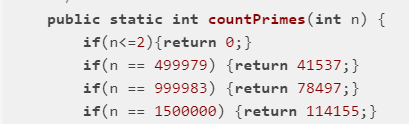

# Leetcode 初级算法 - 数学

二级标题格式：\[章节内题号\] \[题库内题号\] \[题目标题\]

## 1 412 Fizz Buzz

我的思路：直接分别对3和5取模.. (大概是智障了 把i和n弄混了 卡了好几分钟...)

```java
public List<String> fizzBuzz(int n) {
    List<String> li = new LinkedList<>();
    for(int i=1;i<=n;i++){
        if(i%3==0||i%5==0){
            li.add(((i%3==0)?"Fizz":"")+((i%5==0)?"Buzz":""));
        } else {
            li.add(String.valueOf(i));
        }
    }
    return li;
}
```

其他思路：一个稍微快一点的解法是直接用count3和count5 从1计数到3或5再恢复到1 相当于内部状态机来处理

另一种解法涉及到 composite pattern 对规则更多的时候更适用... [来源](https://leetcode.com/problems/fizz-buzz/discuss/89936/Java-Fuzz-Buzz-Follow-up(no-if-else-and-extendable))
具体做法是通过把所有规则放入一个map 然后每次检查适用的规则添加字符串...

```java
class Solution {
    public List<String> fizzBuzz(int n) {
        if (n <= 0) {
            return new ArrayList();
        }
        TreeMap<Integer, String> map = new TreeMap<>((a, b) -> a - b); // define the order of how you want to concat the words here using lambda comparator
        map.put(3, "Fizz");
        map.put(5, "Buzz");
        // map.put(7, "Yuzz"); 
        // map.put(9, "Mozz"); add more encoding options here ... 
        List<String> numsStrs = new LinkedList();
        for (int i = 1; i <= n; i++) { 
            StringBuilder encoded = new StringBuilder();
            for (int num : map.keySet()) {
                if (i % num == 0) encoded.append(map.get(num));
            }
            numsStrs.add((encoded.length() == 0) ? String.valueOf(i) : encoded.toString());
        }
        return numsStrs;
    }
}
```

## 2 204 计数质数

我的思路：最直接的思路是筛法 然而超时了...

解答：实际上单纯的筛法复杂度能达到O(n2) 但是如果用p<sqrt(n)作为终止条件 可以把复杂度降到O(n1.5) 于是就可以过了... （大一没学好啊...现在又忘了...）

```java
public int countPrimes(int n) {
    List<Integer> li = new LinkedList<>();
    for(int i=2;i<n;i++){
        boolean isPrime = true;
        double s = Math.sqrt(i);
        for(int j:li){
            if(j>s) break;
            if(i%j==0){
                isPrime = false;
                break;
            }
        }
        if(isPrime) li.add(i);
    }
    return li.size();
}
```

其他思路：似乎用boolean[]来存储可以显著提高速度...

```java
public int countPrimes(int n) {
    boolean[] isnotp = new boolean[n];
    int cnt=0;
    for(int i=2;i<n;i++){
        if(isnotp[i]) continue;
        cnt++;
        for(int j=1;j*i<n;j++){
            isnotp[j*i]=true;
        }
    }
    return cnt;
}
```

其他思路：打表选手...




## 3 326 3的幂

我的思路：只能想到循环或者递归的解法

```java
public boolean isPowerOfThree(int n) {
    if(n==0) return false;
    if(n==1) return true;
    if(n%3!=0) return false;
    return isPowerOfThree(n/3);
}
```

```java
public boolean isPowerOfThree(int n) {
    while(n!=0&&n!=1){
        if(n%3!=0) return false;
        else n=n/3;
    }
    if(n==0) return false;
    else return true;
}
```

其他思路：直接利用对数的性质 如果n是3的幂 那么log(n)/log(3) 应该是个整数 [来源](https://blog.csdn.net/NoMasp/article/details/50540517)

坑：需要注意下精度问题...

```java
public boolean isPowerOfThree(int n) {
    double d = Math.log(n)/Math.log(3);
    return Math.abs(d-Math.round(d))<1e-10;
}
```

其他思路：转换成三进制 然后看是否是1后面跟0 [来源](https://leetcode.com/problems/power-of-three/solution/)

```java
String baseChange = Integer.toString(number, base);
boolean powerOfThree = baseChange.matches("^10*$")
```

其他思路：直接检查 int内最大的3次方 (3^19) 是否是输入数的倍数 [来源](https://leetcode.com/problems/power-of-three/discuss/77856/1-line-java-solution-without-loop-recursion)

```java
public boolean isPowerOfThree(int n) {
    // 1162261467 is 3^19,  3^20 is bigger than int  
    return ( n>0 &&  1162261467%n==0);
}
```

其他思路：考虑到实际上int内3的幂并没有这么多 可以直接打表 甚至用HashSet来优化 [来源（leetcode上此题总结帖）](https://leetcode.com/problems/power-of-three/discuss/77876/**-A-summary-of-all-solutions-(new-method-included-at-15%3A30pm-Jan-8th))

```java
public boolean isPowerOfThree(int n) {
    HashSet<Integer> set = new HashSet<>(Arrays.asList(1, 3, 9, 27, 81, 243, 729, 2187, 6561, 19683, 59049, 177147, 531441, 1594323, 4782969, 14348907, 43046721, 129140163, 387420489, 1162261467));
    return set.contains(n);
}
```

## 4 13 罗马数字转整数

我的思路：先写了一个转换字母到数字的函数 然后判断是否需要对6种相减的特殊情况进行处理... （实际上就是记录上一个需要相减的值 然后减去两倍）

```java
public int romanToInt(String s) {
    char[] arr = s.toCharArray();
    int sum = 0;
    int n = arr.length;
    boolean negchk = false;
    char lastneg = '0';
    for(int i=0;i<n;i++){
        char c = arr[i];
        sum+=conv(c);
        if(negchk){
            boolean minus = false;
            if(lastneg=='I'){
                if(c=='V'||c=='X'){
                    minus = true;
                }
            } else if (lastneg=='X'){
                if(c=='L'||c=='C'){
                    minus = true;
                }
            } else if (lastneg=='C'){
                if(c=='D'||c=='M'){
                    minus = true;
                }
            }
            if(minus) sum-=2*conv(lastneg);
            negchk = false;
        }
        if(c=='I'||c=='X'||c=='C'){
            negchk = true;
            lastneg = c;
        } else {
            negchk = false;
        }
    }
    return sum;
}

public static int conv(char c){
    switch(c){
        case 'I': return 1;
        case 'V': return 5;
        case 'X': return 10;
        case 'L': return 50;
        case 'C': return 100;
        case 'D': return 500;
        case 'M': return 1000;
    }
    return 0;
}
```

其他思路：一种方法是近似暴力 列出所有可能的组合 [来源](https://leetcode.com/problems/roman-to-integer/discuss/6529/My-solution-for-this-question-but-I-don't-know-is-there-any-easier-way)

相对好一点的做法是通过比较之前的数是否小于之后的数来判断是否要相减 这样就不用再用标志位去记录了 [来源](https://leetcode.com/problems/roman-to-integer/discuss/6547/Clean-O(n)-c%2B%2B-solution)

```java
public int romanToInt(String s) {
    char[] arr = s.toCharArray();
    int sum = conv(arr[0]);
    int n = arr.length;
    for(int i=1;i<n;i++){
        if(conv(arr[i])<=conv(arr[i-1])){
            sum+=conv(arr[i]);
        } else {
            sum-=2*conv(arr[i-1]);
            sum+=conv(arr[i]);
        }
    }
    return sum;
}
```

