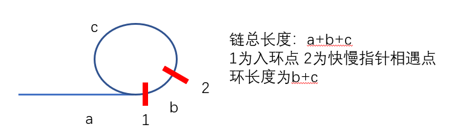

# Leetcode 初级算法 - 字符串链表

二级标题格式：\[章节内题号\] \[题库内题号\] \[题目标题\]

## 1 237 删除链表中的节点

这题读的一头雾水 还以为应该有两个输入 一个head和一个node 但是最后只有一个...

然后读了下他人的解释 原来就是直接删除给定节点

再注意到题目开头给了一堆限制条件 不是尾部节点 那就放心直接删除就好了

```java
class Solution {
    public void deleteNode(ListNode node) {
        node.val = node.next.val;
        node.next = node.next.next;
    }
}
```


## 2 19 删除链表的倒数第N个节点

我的思路：如果想要只扫一遍 我就直接用一个 List 来记录每个节点 然后直接找到前一个结点删除就好了... （坑：需要处理下被删除的是头节点的情况）

```java
public ListNode removeNthFromEnd(ListNode head, int n) {
    if(head==null){
        return null;
    }
    List<ListNode> li = new ArrayList<>();
    ListNode cur = head;
    while(cur!=null){
        li.add(cur);
        cur = cur.next;
    }
    if(li.size()-n-1>=0){
        ListNode toremove = li.get(li.size()-n-1);
        toremove.next = toremove.next.next;
        li.remove(li.size()-n);
        return li.get(0);
    } else {
        if(li.size()>=2){
            return li.get(1);
        } else {
            return null;
        }
    }
}
```

其他思路：其实可以不用开链表 用快慢指针法

快指针比慢指针提前走n+1步 这样快指针到null的时候 满指针也就刚好到了要删除的节点的位置

处理头部的时候 可以用一个dummy放在头部前面 这样头部就不用再写特判了

```java
public ListNode removeNthFromEnd(ListNode head, int n) {
    if(head==null){
        return null;
    }
    ListNode dummy = new ListNode(0);
    dummy.next=head;
    ListNode fast = dummy;
    ListNode slow = dummy;
    int cnt = 0;
    while(cnt<=n){
        fast = fast.next;
        cnt++;
    }
    while(fast!=null){
        fast = fast.next;
        slow = slow.next;
    }
    slow.next = slow.next.next;
    return dummy.next;
}	
```


## 3 206 反转链表

我的思路：三个指针 依次前进 （坑：最后一个节点也需要链接上去）

```java
public ListNode reverseList(ListNode head) {
    if(head==null){
        return null;
    }
    if(head.next==null){
        return head;
    }
    ListNode p1 = head, p2 = head.next, p3=null;
    head.next = null;
    while(p2.next!=null){
        p3 = p2.next;
        p2.next = p1;
        if(p2.next==null){
            break;
        }
        p1 = p2;
        p2 = p3;
    }
    p2.next = p1; // last connection
    return p2;
}
```

其他思路：更加简单的三指针

```java
public ListNode reverseList(ListNode head) {
    ListNode newHead = null;
    while(head!=null){
        ListNode nextNode = head.next;
        head.next = newHead;
        newHead = head;
        head = nextNode;
    }
    return newHead;
}
```


## 4 21 合并两个有序链表

我的思路：边比较边合并 如果一边走完了就直接把剩下另一条链合入主链 （坑：注意判定输入为null）

循环写法

```java
public ListNode mergeTwoLists(ListNode l1, ListNode l2) {
    ListNode newHead = null;
    if(l1==null&&l2==null) return null;
    else if (l1==null) return l2;
    else if (l2==null) return l1;
    if(l1.val<=l2.val){
        newHead = l1; l1=l1.next;
    } else {
        newHead = l2; l2=l2.next;
    }
    ListNode cursor = newHead;
    while(l1!=null&&l2!=null){
        if(l1.val<=l2.val){
            cursor.next = l1;
            l1 = l1.next;
        } else {
            cursor.next = l2;
            l2 = l2.next;
        }
        cursor = cursor.next;
    }
    if(l1!=null){
        cursor.next = l1;
    } else if (l2!=null){
        cursor.next = l2;
    }
    return newHead;
}
```

其他思路：这个题目也能用递归来完成 具体做法很神奇 直接看代码吧...

```java
public ListNode mergeTwoLists(ListNode l1, ListNode l2) {
    if(l1==null) return l2;
    else if(l2==null) return l1;

    if(l1.val<=l2.val){
        // should connect l1, so return l1
        l1.next = mergeTwoLists(l1.next, l2);
        return l1;
    } else {
        // should connect l2, so return l2
        l2.next = mergeTwoLists(l1, l2.next);
        return l2;
    }
}
```

## 5 回文链表

我的思路：虽然要求用O(1)的空间复杂度 但是我没有什么好的想法 最后还是上了 List

虽然想用快慢指针 但是想不到办法从后面逆向走回前面... 或者用栈保存前一个值？似乎也不太行...

坑：`"129 129"` 如果直接用Integer 需要用equals而不能用== -128~128有缓存 但是其他整数没有

```java
public boolean isPalindrome(ListNode head) {
    if(head==null) return true;
    if(head.next==null) return true;
    List<Integer> li = new ArrayList<>();
    while(head!=null){
        li.add(head.val);
        head = head.next;
    }
    int i=0, j=li.size()-1;
    while(i<j){
        if(!li.get(i).equals(li.get(j))){
            return false;
        } else {
            i++;j--;
        }
    }
    return true;
}
```

其他解法：快慢指针+栈

快指针一次两步 慢指针一次一步 快指针到达尾部时 慢指针应该在链表中央

慢指针每次访问的数值入栈 然后一步步出栈就好了

```java
public static boolean isPalindrome(ListNode head) {
    if(head==null) return true;
    if(head.next==null) return true;
    if(head.next.next==null) return head.val==head.next.val;
    Stack<Integer> s = new Stack<>();
    ListNode fast = head, slow = head;
    s.push(head.val);
    while(fast.next!=null&&fast.next.next!=null){
        slow = slow.next;
        fast = fast.next.next;
        s.push(slow.val);
    }
    if(fast.next==null){
        // judge even or odd length of linked list
        s.pop();
    }
    slow = slow.next;
    while(slow!=null){
        if(s.isEmpty()) return false;
        if(s.peek()!=slow.val) return false;
        else{
            slow = slow.next;
            s.pop();
        }
    }
    return true;
}
```

最优解法：快慢指针+翻转

快慢指针依然相同 从慢指针对链表断开 对前半部分进行翻转 然后就是单纯的逐步比较了

```java
public static boolean isPalindrome(ListNode head) {
    if(head==null) return true;
    if(head.next==null) return true;
    if(head.next.next==null) return head.val==head.next.val;
    ListNode fast = head, slow = head;
    while(fast.next!=null&&fast.next.next!=null){
        slow = slow.next;
        fast = fast.next.next;
    }
    ListNode n2 = slow.next;

    // do the reverse
    ListNode last = null;
    while(n2!=null){
        ListNode nextNode = n2.next;
        n2.next = last;
        last = n2;
        n2 = nextNode;
    }

    // two direction check
    while(last!=null){
        if(last.val!=head.val){
            return false;
        } else {
            last = last.next;
            head = head.next;
        }
    }
    return true;
}
```

## 6 环形链表

我的思路：链表判环问题 直接上快慢指针 看是否会相遇 （坑：head为null）

```java
public boolean hasCycle(ListNode head) {
    if(head==null) return false;
    ListNode fast = head, slow = head;
    while(fast.next!=null&&fast.next.next!=null){
        slow = slow.next;
        fast = fast.next.next;
        if(slow==fast) return true;
    }
    return false;
}
```

## 6 进阶：找到环形链表入环的位置 （142 环形链表 II）

这里思路大致相同 依然是快慢指针

先用快慢指针判断是否有环 确认有环之后再用新的一组指针（现在是相同速度的） 来判断入环点

具体而言 从head开始新出发一个指针tmp 从之前fast slow相遇处让slow接着出发 两者都是每次走一格 最后相遇的时候一定是入环点

```java
public ListNode detectCycle(ListNode head) {
    if(head==null) return null;
    ListNode fast = head, slow = head;
    boolean hasCycle = false;
    while(fast.next!=null&&fast.next.next!=null){
        slow = slow.next;
        fast = fast.next.next;
        if(slow==fast){
            hasCycle = true;
            break;
        }
    }
    if(!hasCycle) return null;
    ListNode tmp = head;
    while(tmp!=slow){
        slow = slow.next;
        tmp = tmp.next;
    }
    return tmp;
}
```

为什么这样是对的？



第一次判断是否有环 使用快慢指针

慢指针前进 $$a+b$$ 快指针前进 $$a+b+n(b+c)$$ 

$$n$$代表快指针在环内转的圈数

第二次判断入环点 使用同速二指针

tmp指针前进 $$a$$ 慢指针前进 $$m(b+c)+c$$ 

$$m$$代表慢指针在环内转的圈数

如果同速二指针法可以判断入环点 则要求$$a=m*(b+c)+c$$ 问题就转化成了证明这个等式

考虑到快慢指针中存在 $$2(a+b) = a+b+n(b+c)$$

消去两侧 $$a+b$$ 可得 $$a+b=n(b+c)$$

两边再同时减去 $$b+c$$ 可得 $$a-c=(n-1)(b+c)$$ 变形即 $$a = (n-1)(b+c) + c$$ 

即得到 $$m = n-1​$$ 得证